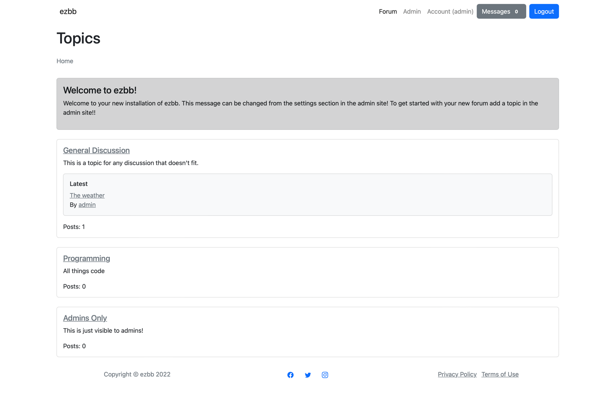
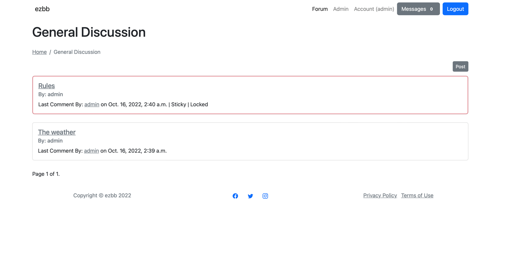
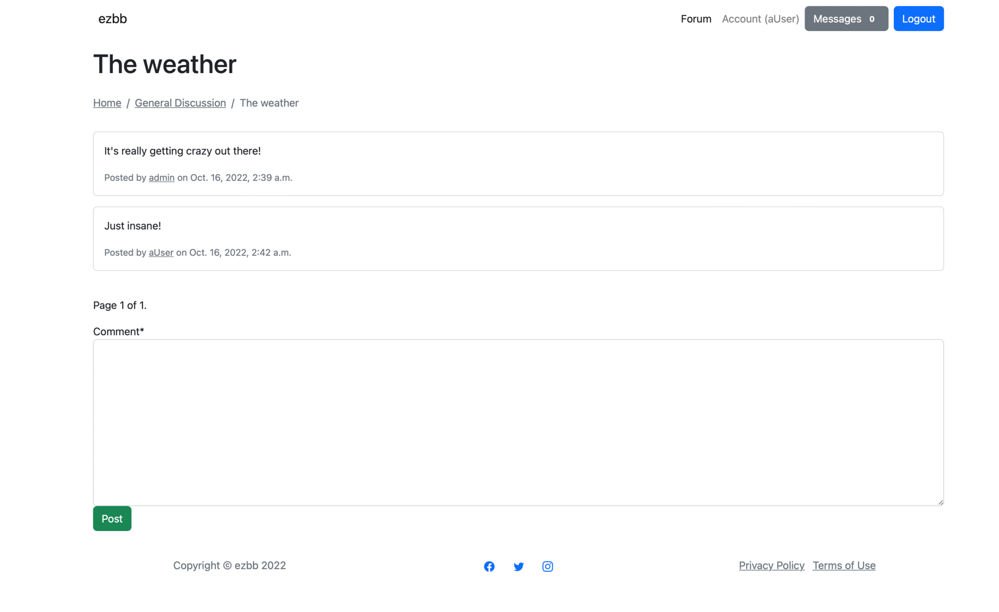
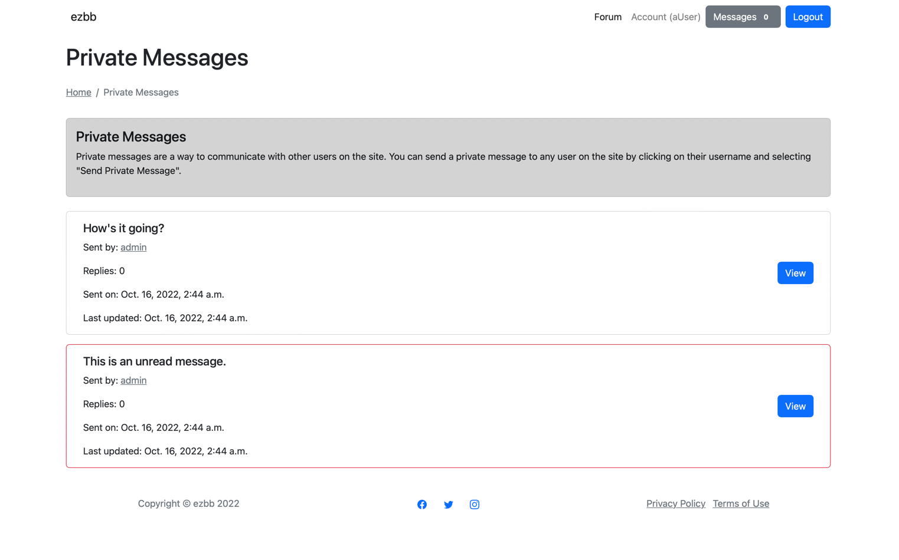
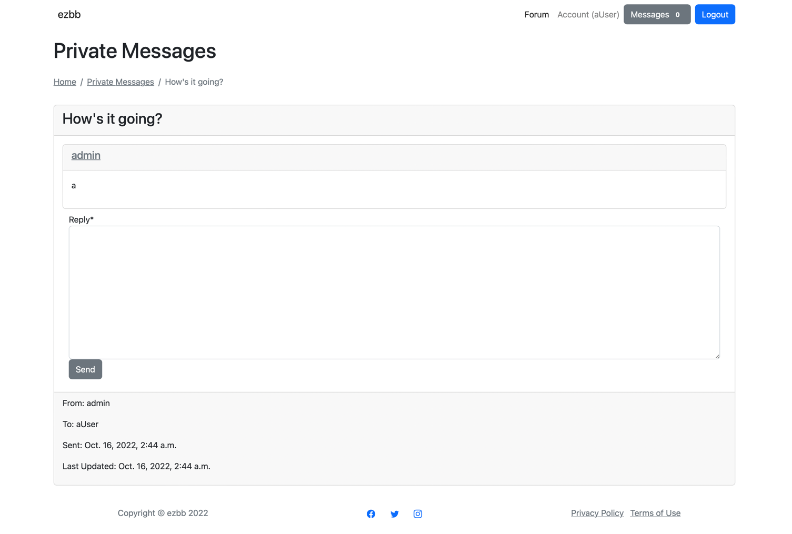

# ezbb
***
**ezbb** is a simple discussion board software written in Django. It is designed to be easy to use and easy to set up. It is also designed to be secure and fast with simple modern design. It is designed for small deployments and not as a drop-in for large community software.

## Table of Contents
* [Deploying](#deploying)
* [Features](#features)
* [Planned Features](#planned-features)
* [Screenshots](#screenshots)
* [License](#license)

## Deploying
***
It is not recommended to use in production, but it is usable. There are still some features that need to be added to be production-grade. However, these are the steps if you really want to.
1. Python 3.9 is required (please use a virtual environment). 
2. Clone the repository, and install the dependencies with `pip install -r requirements.txt`.
3. Edit ezbb/settings.py to your liking. Always set a secret key, *TURN DEBUG OFF*, database settings (sqlite is fine for testing), email_backend.
4. Run `python manage.py migrate` to create the database.
5. Run `python manage.py createsuperuser` to create an admin user.
6. Run `python manage.py check --deploy` to ensure production settings are correct.
7. Run `python manage.py runserver` to start the server.
8. *Always* deploy behind a reverse proxy (nginx, apache, etc) for security and performance.

## Features
***
- Topics, posts, comments
- Sticky, lock, visibility options
- Rich administration
- Private messages
- User profiles
- Registration

## Planned Features
***
- Markdown support
- Global notifications/thread subscriptions
- Dark Theme
- Full email integration in user workflow (registration confirmation, reset, etc)

## Screenshots
***
A few screenshots to showcase the feel of the software.

Index:

Topic View:

Post View:

Private Message Home:

Private Message View:

## License
***
ezbb is licensed under the MIT license. See LICENSE for more information.